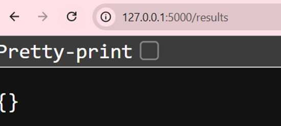
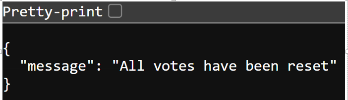
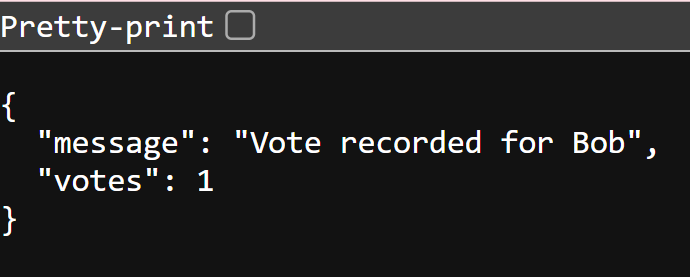
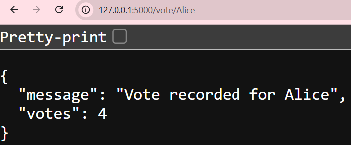
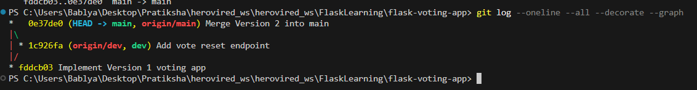

# Flask Voting Application

## Project Description

This is a simple Flask-based Voting Application developed using Python and Flask. Users can cast votes for candidates through URL endpoints and view the current voting results in JSON format. The application stores data in memory using a Python dictionary and includes a reset feature to clear all votes.

The project follows a Git workflow using `dev` and `main` branches to demonstrate version control and feature-based development.

---

## Technologies Used

* Python 3
* Flask
* Git
* GitHub

---

## Installation and Setup

### Clone the repository

```bash
git clone https://github.com/pratikshamore7855-rgb/flask-voting-app.git
cd flask-voting-app
```

### Create virtual environment

```bash
python -m venv venv
```

### Activate virtual environment

Windows:

```bash
.\venv\Scripts\Activate.ps1
```

### Install dependencies

```bash
pip install -r requirements.txt
```

### Run the application

```bash
python app.py
```

Application runs at:

```text
http://localhost:5000
```

---

## API Endpoint Reference

| Endpoint       | Method | Description                    | Example Response                          |
| -------------- | ------ | ------------------------------ | ----------------------------------------- |
| `/`            | GET    | Welcome page                   | Welcome to the App                        |
| `/health`      | GET    | Health check                   | App is running                            |
| `/vote/<name>` | GET    | Records a vote for a candidate | `{"message":"Vote recorded","votes":1}`   |
| `/results`     | GET    | Shows vote count               | `{"Alice":2,"Bob":1}`                     |
| `/reset`       | GET    | Clears all votes               | `{"message":"All votes have been reset"}` |

---

## Git Workflow

Development was performed using the `dev` branch. After successful testing, changes were merged into the `main` branch.

Workflow:

```text
Version 1
    ↓
Develop on dev
    ↓
Commit and Push
    ↓
Merge into main

Version 2
    ↓
Develop on dev
    ↓
Commit and Push
    ↓
Merge into main
```

---

## Version History

| Version   | Features                                                          |
| --------- | ----------------------------------------------------------------- |
| Version 1 | Home endpoint, health endpoint, voting endpoint, results endpoint |
| Version 2 | Added reset endpoint                                              |

---

## Git Commit History

* `Implement Version 1 voting app`
* `Add vote reset endpoint`
* `Merge Version 2 into main`

---

## Screenshots

### Application Running

Add screenshot:

```text

```

Example:

```markdown

```

```markdown

```

```markdown

```

```markdown

```

---

### Git History

Add screenshot:

```text
screenshots/githistory.png
```

Example:

```markdown

```

---

## Author

Pratiksha More
